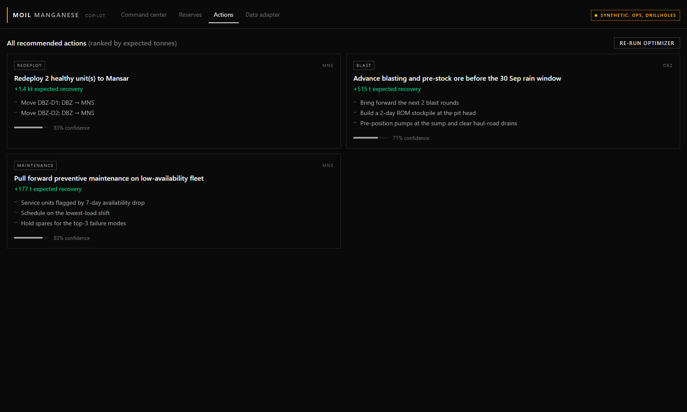
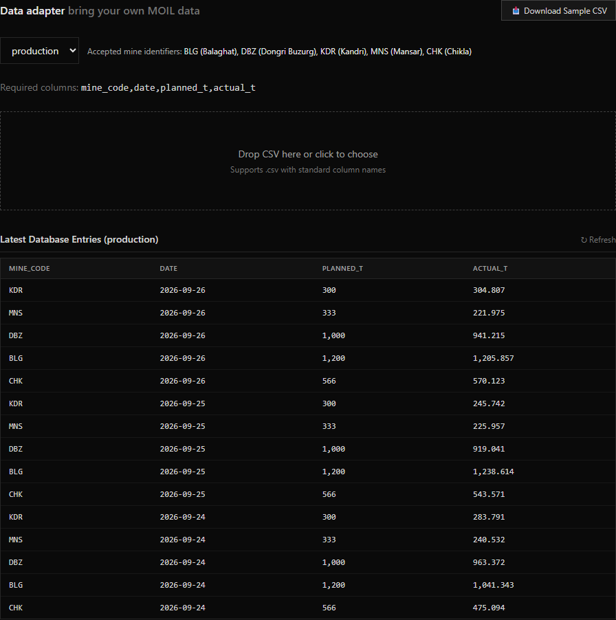

<div align="center">

# MOIL Manganese Copilot

### From mine signals to confident next-shift decisions.

**SIH 2026 · Problem Statement 26009**

</div>

<p align="center">
  <a href="docs/media/moil-short-demo.webm">
    
  </a>
  <br>
  <sub>▶ Open the short product walkthrough</sub>
</p>

Mining decisions are connected: where to explore, what the orebody may hold, and how to keep production on plan. MOIL Copilot brings those signals together so teams can move from **spotting risk** to **understanding why** and **choosing what to do next**.

## One connected view

- **Explore:** satellite and geology indicators help rank areas for investigation; drill assays inform reserve estimates.
- **Anticipate:** production, rainfall, equipment, and blasting signals help reveal shortfall risk and its drivers.
- **Respond:** practical recommendations are ranked by expected recovery, with confidence and what-if simulation.

<p align="center">
  
  <br>
  <sub>Bring mine data into the same operational picture.</sub>
</p>

## Built with honesty

Satellite signals **do not see manganese underground**; they help identify places worth investigating. The demo clearly labels synthetic operations and drill data. Weather can use live Open-Meteo feeds; operational data becomes genuinely mine-specific when real records are supplied.

## Try the demo

Requires Docker Desktop and GNU Make. From the project folder, copy `.env.example` to `.env` (PowerShell: `Copy-Item .env.example .env`), then run:

```bash
make up seed train run
```

Open <http://localhost:5173>. The API explorer is at <http://localhost:8000/docs>.

**Five MOIL mines. One clearer path from uncertainty to action.**
