# MOIL Manganese MVP: Build Plan

**SIH 2026 · Problem Statement 26009** — *Using AI/ML and Space Technology to Identify Manganese Reserves and Overcome Production Shortfalls* (MOIL Ltd., Ministry of Steel)

---

## 1. Framing (say this in your pitch)

Satellites can't see manganese underground. They see **indirect indicators**: lithology, ferruginous caps, structure, vegetation stress, moisture. So split the problem into three stages:

1. **Where to look**: satellite + geology → prospectivity map (ML).
2. **How much is there**: drill-hole assays → 3D kriging → tonnage with uncertainty.
3. **Will we hit the plan**: weather + equipment + blasting → shortfall forecast → optimizer suggests fixes.

MOIL's operational data isn't public. Build a **data adapter** (a fixed CSV schema real data drops into) and a **realistic synthetic generator** for the demo. Say this openly; it's a strength, not a weakness.

---

## 2. Architecture

```dot
digraph MOIL {
  rankdir=LR; fontname="Helvetica";
  node [shape=box, style="rounded,filled", fillcolor="#f4f4f4", fontname="Helvetica"];

  subgraph cluster_src { label="Sources"; style=dashed;
    sat [label="Satellite\nSentinel-2, ASTER, MODIS,\nSMAP, CHIRPS, DEM"];
    geo [label="Geology\nGSI Bhukosh, MRDS,\ngeochem, geophysics"];
    ops [label="MOIL ops (CSV adapter)\ndrillholes, production,\nequipment, blast logs"];
    wx  [label="Forecast\nOpen-Meteo / IMD"];
  }
  subgraph cluster_ing { label="Ingestion (Python, cron)"; style=dashed;
    gee [label="GEE / rasterio\nfeature extraction"];
    etl [label="Validation + ETL\n(pandera)"];
  }
  subgraph cluster_store { label="Storage"; style=dashed;
    pg  [label="PostgreSQL + PostGIS\n(+ TimescaleDB)", fillcolor="#dbeafe"];
    cog [label="COG rasters\n(MinIO / disk)", fillcolor="#dbeafe"];
  }
  subgraph cluster_ml { label="Models"; style=dashed;
    A [label="A. Prospectivity\nLightGBM + spatial CV + SHAP", fillcolor="#dcfce7"];
    B [label="B. Reserve model\n3D kriging → tonnes P10/P50/P90", fillcolor="#dcfce7"];
    C [label="C. Shortfall forecast\nquantile GBM + breakdown clf", fillcolor="#dcfce7"];
    D [label="D. Recommender\nrules + PuLP optimizer", fillcolor="#fef9c3"];
  }
  api [label="FastAPI\n+ TiTiler (raster tiles)"];
  ui  [label="React + MapLibre\nECharts dashboard", fillcolor="#fde2e2"];

  sat -> gee; geo -> etl; ops -> etl; wx -> etl; gee -> etl;
  etl -> pg; etl -> cog;
  pg -> A; cog -> A; pg -> B; pg -> C; A -> B [style=dashed, label="target zones"];
  C -> D; B -> D;
  A -> api; B -> api; C -> api; D -> api; api -> ui;
}
```



**Plain English:** Data comes in from four places and gets cleaned into Postgres/PostGIS and raster files. Four models sit on top: one ranks land by manganese likelihood, one estimates tonnage from drill holes, one forecasts next-week/month production risk, and one turns the forecast into concrete actions. A FastAPI layer serves everything to a map-first dashboard.

---

## 3. Module A: Reserve prospectivity mapping

**Labels:** Known Mn deposits and occurrences (positives). Sources: GSI mineral maps, USGS MRDS filtered to India/Manganese, MOIL mine locations from annual reports. Draw pseudo-negatives randomly outside a buffer around positives. This is positive-unlabeled learning, so state that caveat.

**Features (per ~30–90 m grid cell):**

- **Spectral:** Sentinel-2/ASTER band ratios for iron-oxide/ferric caps, clay/hydroxyl indices, PCA of SWIR bands
- **Structure:** lineament density and distance-to-fault (DEM + Sentinel-1), slope, curvature, drainage density
- **Geology:** lithology class (Sausar Group in the Nagpur–Bhandara–Balaghat belt), geochem Mn/Fe from national geochemical mapping
- **Geophysics:** magnetic and gravity anomalies
- **Bio/thermal:** NDVI anomaly (geobotanical stress), land surface temperature anomaly

**Model:** LightGBM, **spatial block CV** (random CV leaks and gives fake 0.99 AUCs), SHAP for explainability. Output: probability GeoTIFF → COG → map layer.

**Metric juries like:** the percent of known deposits captured in the top 10% of area.

```python
import numpy as np, pandas as pd, lightgbm as lgb, shap
from sklearn.model_selection import GroupKFold
from sklearn.metrics import roc_auc_score, average_precision_score

df = pd.read_parquet("data/train_points.parquet")   # lon, lat, label, <features>
FEATURES = [c for c in df.columns if c not in ("lon", "lat", "label")]
df["block"] = (df.lon // 0.1).astype(int).astype(str) + "_" + (df.lat // 0.1).astype(int).astype(str)

oof = np.zeros(len(df))
for tr, va in GroupKFold(5).split(df, df.label, df.block):
    m = lgb.LGBMClassifier(n_estimators=400, learning_rate=0.03, num_leaves=31,
                           subsample=0.8, colsample_bytree=0.8, class_weight="balanced")
    m.fit(df.loc[tr, FEATURES], df.label[tr])
    oof[va] = m.predict_proba(df.loc[va, FEATURES])[:, 1]

print("AUC", roc_auc_score(df.label, oof), "AP", average_precision_score(df.label, oof))
final = lgb.LGBMClassifier(n_estimators=400, learning_rate=0.03).fit(df[FEATURES], df.label)
shap_vals = shap.TreeExplainer(final).shap_values(df[FEATURES])   # feature importance panel
```

---

## 4. Module B: Reserve estimation (tonnes with uncertainty)

Prospectivity says *where*. Drill-hole assays say *how much*. For the demo, generate synthetic drill holes from a known ground-truth ore body so you can show kriging recovering it.

```python
import numpy as np
from pykrige.ok3d import OrdinaryKriging3D

# x, y, z = sample coords (m); grade = Mn %
ok = OrdinaryKriging3D(x, y, z, grade, variogram_model="spherical", nlags=12)
gx, gy, gz = np.arange(0, 2000, 25), np.arange(0, 1500, 25), np.arange(0, 200, 5)
g, var = ok.execute("grid", gx, gy, gz)              # shape (nz, ny, nx)

CUTOFF, DENSITY = 25.0, 3.6                           # % Mn, t/m3: placeholders, tune
block_vol = 25 * 25 * 5
tonnes = ((g >= CUTOFF) * block_vol * DENSITY).sum()
# P10/P90: sample grade ~ N(g, sqrt(var)) 200x, recompute tonnes
```

Show **P10/P50/P90 tonnage**, not a single number. It's more credible, and reserve reporting is uncertain anyway.

---

## 5. Module C: Shortfall prediction

**Data (per mine, per day):** planned vs actual tonnes, equipment availability, breakdown events, blast delays, shift attendance, plus rainfall, soil moisture, LST, and NDVI.

**Features:** rolling rain sums (3/7/14 d), soil moisture (SMAP), lagged availability, MTBF/MTTR rolling stats, days since last blast, forecast rain for the next 7 days (Open-Meteo), monsoon flag, open-cast vs underground flag.

**Targets:**

- Cumulative shortfall % over the next 7/14/30 days: **quantile LightGBM** (0.1/0.5/0.9 gives a risk band)
- P(shortfall > 10%): classifier, drives the red/amber/green risk tile
- P(major breakdown in 7 d): classifier per equipment class

Use a **time-based split**, never random.

**Synthetic data generator**

```python
import numpy as np, pandas as pd

rng = np.random.default_rng(42)
days = pd.date_range("2022-04-01", "2026-08-31")

def simulate(mine, plan=1200, opencast=True):
    d = pd.DataFrame({"date": days}); doy = d.date.dt.dayofyear.values
    monsoon = np.exp(-((doy - 215) / 40) ** 2)
    d["rain"] = rng.gamma(0.4, 1, len(d)) * (2 + 45 * monsoon)
    d["soil_m"] = d.rain.ewm(alpha=0.15).mean().clip(0, 60) / 60        # 0..1
    d["avail"] = np.clip(rng.beta(9, 1.5, len(d)) - 0.25 * (rng.random(len(d)) < 0.04), 0.3, 1)
    d["blast_delay"] = rng.random(len(d)) < 0.08
    eff = (1
           - (0.35 * (d.soil_m > 0.5) + 0.25 * (d.rain.rolling(3).sum() > 60)) * opencast
           - 0.6 * (1 - d.avail)
           - 0.15 * d.blast_delay)
    d["planned"] = plan
    d["actual"] = (plan * eff.clip(0.2, 1.05) * rng.normal(1, 0.05, len(d))).clip(0)
    d["mine"] = mine
    return d

data = pd.concat([simulate("A", 1200, True), simulate("B", 900, False), simulate("C", 1500, True)])
```

**Quantile models**

```python
import lightgbm as lgb
qmodels = {a: lgb.LGBMRegressor(objective="quantile", alpha=a, n_estimators=500,
                                learning_rate=0.03).fit(Xtr, ytr) for a in (0.1, 0.5, 0.9)}
# check coverage: fraction of yva inside [q10, q90] should be ≈ 0.8
```

Document the synthetic causal structure in your slides. It doubles as the "here's what we assume MOIL's real data looks like" slide.

---

## 6. Module D: Corrective-action recommender

Two layers:

1. **Rules** (interpretable, fast): heavy rain forecast on an open-cast mine → advance blasting/stockpile ore before the rain window; equipment breakdown risk high → pull forward preventive maintenance to a low-load day; underground mine has headroom → shift priority there.
2. **Optimizer**: reassign equipment units across mines to maximize expected tonnes recovered.

```python
import pulp as pl

prob = pl.LpProblem("redeploy", pl.LpMaximize)
x = pl.LpVariable.dicts("x", (units, mines), cat="Binary")     # unit u → mine m
prob += pl.lpSum(x[u][m] * gain[u][m] for u in units for m in mines)
for u in units: prob += pl.lpSum(x[u][m] for m in mines) <= 1
for m in mines: prob += pl.lpSum(x[u][m] for u in units) <= slots[m]
prob.solve(pl.PULP_CBC_CMD(msg=0))
moves = [(u, m) for u in units for m in mines if x[u][m].value() == 1]
```

`gain[u][m]` = predicted shortfall at mine *m* × unit productivity − transfer-time loss. Add a grade-blend constraint if you have time. Each recommendation should show **expected tonnes recovered, confidence, and top SHAP drivers**. Optional: have an LLM turn the structured output into a two-sentence plain-English brief.

---

## 7. Datasets

### Space / climate

| Data | Use | Link |
|---|---|---|
| Sentinel-2 L2A | Spectral indices, NDVI | https://dataspace.copernicus.eu · GEE: https://developers.google.com/earth-engine/datasets/catalog/COPERNICUS_S2_SR_HARMONIZED |
| Sentinel-1 SAR | Lineaments, surface roughness | https://developers.google.com/earth-engine/datasets/catalog/COPERNICUS_S1_GRD |
| ASTER L1T | Iron-oxide/clay mineral ratios | https://lpdaac.usgs.gov/products/ast_l1tv003/ |
| Landsat 8/9 | Thermal, long history | https://earthexplorer.usgs.gov |
| MODIS NDVI (MOD13Q1) | Vegetation trend | https://lpdaac.usgs.gov/products/mod13q1v061/ |
| MODIS LST (MOD11A1) | Land temperature | https://lpdaac.usgs.gov/products/mod11a1v061/ |
| SMAP L4 (SPL4SMGP) | Soil moisture | https://nsidc.org/data/spl4smgp/versions/7 |
| CHIRPS | Daily rainfall, 0.05° | https://www.chc.ucsb.edu/data/chirps |
| GPM IMERG | Near-real-time rain | https://gpm.nasa.gov/data/imerg |
| ERA5-Land | Reanalysis (temp, soil water, rain) | https://cds.climate.copernicus.eu/datasets/reanalysis-era5-land |
| NASA POWER | Easy point weather API | https://power.larc.nasa.gov/data-access-viewer/ |
| Open-Meteo | Free forecast API (no key) | https://open-meteo.com/en/docs |
| IMD gridded data | Indian rainfall/temp; use `imdlib` | https://pypi.org/project/imdlib/ · https://www.imdpune.gov.in/ |
| SRTM 30 m / Copernicus DEM | Terrain, faults, drainage | https://developers.google.com/earth-engine/datasets/catalog/USGS_SRTMGL1_003 · https://registry.opendata.aws/copernicus-dem/ |
| SoilGrids | Soil properties | https://soilgrids.org |

### Indian space sources (score points on the "Space Technology" theme)

- ISRO Bhoonidhi (Resourcesat LISS, Cartosat DEM): https://bhoonidhi.nrsc.gov.in
- ISRO Bhuvan (LULC, thematic layers): https://bhuvan.nrsc.gov.in
- MOSDAC (INSAT-3D/3DR rainfall, soil moisture products): https://www.mosdac.gov.in

### Geology / minerals

| Data | Use | Link |
|---|---|---|
| GSI Bhukosh | Geological & mineral maps, geophysics, reports. Registration required; you search, add items to a download cart, and the data is delivered to your email. Start this early. | https://bhukosh.gsi.gov.in/Bhukosh/Public |
| USGS MRDS | Global deposit points; filter India + Manganese for labels | https://mrdata.usgs.gov/mrds/ |
| Indian Bureau of Mines | Indian Minerals Yearbook (Mn production stats) for calibrating synthetic data | https://ibm.gov.in |
| MOIL | Annual reports: mine names, grades, production, reserves | https://www.moil.nic.in |
| EMAG2 magnetic grid | Magnetic anomaly | https://www.ncei.noaa.gov/products/earth-magnetic-model-anomaly-grid-2 |
| WGM2012 gravity | Gravity anomaly | https://bgi.obs-mip.fr/data-products/grids-and-models/wgm2012-global-model/ |

### Equipment / ops (proxies only)

| Data | Use | Link |
|---|---|---|
| AI4I 2020 Predictive Maintenance | Pipeline dev for breakdown classifier | https://archive.ics.uci.edu/dataset/601/ai4i+2020+predictive+maintenance+dataset |
| NASA C-MAPSS / PCoE repository | Remaining-useful-life pipeline | https://www.nasa.gov/intelligent-systems-division/discovery-and-systems-health/pcoe/pcoe-data-set-repository/ |
| Kaggle mining process quality | Mining time-series handling | https://www.kaggle.com/datasets/edumagalhaes/quality-prediction-in-a-mining-process |

Be honest in the pitch: the equipment datasets validate your *pipeline*, not real MOIL machines. No public Indian mine drill-hole or production-log data exists, so synthetic data is the way.

GEE collection IDs get renamed occasionally, so check the catalog if a call 404s.

---

## 8. Feature extraction (GEE)

```python
import ee, geemap
ee.Initialize(project="YOUR_GCP_PROJECT")

# Placeholder points: replace with real lease boundaries
mines = ee.FeatureCollection([
    ee.Feature(ee.Geometry.Point([79.30, 21.32]).buffer(3000), {"mine": "A"}),
    ee.Feature(ee.Geometry.Point([80.20, 21.80]).buffer(3000), {"mine": "B"}),
])
LAYERS = {   # name: (collection, band, scale_m, multiplier)
    "rain_mm":  ("UCSB-CHG/CHIRPS/DAILY", "precipitation", 5000, 1),
    "sm_surf":  ("NASA/SMAP/SPL4SMGP/007", "sm_surface", 11000, 1),
    "lst_day":  ("MODIS/061/MOD11A1", "LST_Day_1km", 1000, 0.02),    # Kelvin → subtract 273.15
    "ndvi":     ("MODIS/061/MOD13Q1", "NDVI", 250, 0.0001),
}
def series(name, start, end):
    coll, band, scale, k = LAYERS[name]
    ic = ee.ImageCollection(coll).filterDate(start, end).select(band)
    fc = ic.map(lambda im: im.reduceRegions(mines, ee.Reducer.mean(), scale)
                  .map(lambda f: f.set("date", im.date().format("YYYY-MM-dd")))).flatten()
    df = geemap.ee_to_df(fc).rename(columns={"mean": name})   # big pulls → ee.batch.Export.table
    df[name] *= k
    return df[["mine", "date", name]]
```

---

## 9. Stack and repo layout

- **Backend:** FastAPI, SQLAlchemy/GeoAlchemy2, PostgreSQL + PostGIS (+ TimescaleDB optional), APScheduler for nightly refresh
- **Rasters:** Cloud-Optimized GeoTIFFs served through TiTiler (`rio-cogeo` to convert)
- **ML:** LightGBM, scikit-learn, SHAP, PyKrige, PuLP/OR-Tools, pandera for schema validation
- **Frontend:** React + Vite, MapLibre GL (map), ECharts/Recharts (charts), Tailwind
- **Fastest demo path:** Streamlit + folium if the team is short on time
- **Deploy:** docker-compose (api, db, titiler, web)

```
moil-mvp/
├─ data/{raw,interim,cogs}/
├─ pipelines/   gee_extract.py  build_features.py  synth_ops.py
├─ models/      prospectivity.py  kriging.py  shortfall.py  recommend.py
├─ api/         main.py  routers/{reserves,risk,actions}.py
├─ web/         src/pages/{Map,Reserves,Risk,Actions}.tsx
└─ docker-compose.yml
```

**API endpoints**

- `GET /prospectivity/tiles/{z}/{x}/{y}`
- `GET /reserves/{mine}` (P10/50/90)
- `GET /risk/{mine}?horizon=14`
- `GET /actions?mine=`
- `POST /ingest/{drillholes|production|equipment}` (the adapter)

---

## 10. Dashboard (4 screens)

1. **Map:** prospectivity heatmap over Sentinel-2 basemap, mine leases, drill-hole points, layer toggles (NDVI, LST, rain).
2. **Reserves:** per-mine tonnage P10/P50/P90, grade histogram, kriging-uncertainty overlay.
3. **Risk:** plan vs actual vs forecast fan chart, red/amber/green tiles per mine, top drivers ("soil moisture + 2 dumpers down").
4. **Actions:** ranked recommendations with expected tonnes recovered, one-click "simulate impact" that re-runs the forecast with the change applied.

---

## 11. Timeline (10 days; compress to a 36-hour cut by skipping Module B's polish)

| Days | Track |
|---|---|
| 1–2 | Bhukosh registration, GEE pipeline, synthetic generator, DB schema, repo/docker skeleton |
| 3–4 | Prospectivity features + model; shortfall features + baseline |
| 5–6 | Kriging on synthetic drill holes; quantile models; API endpoints |
| 7–8 | Optimizer + rules; dashboard screens wired to the API |
| 9 | Backtest, calibration plots, SHAP panels, polish |
| 10 | Demo script, slides, fallback recording |

**Split by role:** (1) geospatial/space pipeline, (2) ML + optimizer, (3) backend/data, (4) frontend.

---

## 12. Demo script (2 minutes)

Open the map with the prospectivity layer → click a mine, see the tonnage range → switch to Risk, show "monsoon week, 22% shortfall likely" → open Actions, apply "advance blasting + redeploy 2 dumpers" → the forecast band shifts up. **That before/after is your money shot.**

---

## 13. Risks

- **Overclaiming:** never say "satellite finds manganese." Say "satellite-derived indicators rank prospective zones; drill data quantifies them."
- **Spatial leakage:** the fastest way to get destroyed in Q&A. Always use block CV.
- **Synthetic data:** disclose it, and show the adapter schema for real data.
- **Small positive set:** keep the model simple (LightGBM/RF), don't reach for deep learning.

---

## 14. Validation metrics

| Module | Metric |
|---|---|
| Prospectivity | AUC-PR under spatial block CV; % of known deposits captured in top 10% of area |
| Reserves | Kriging cross-validation error; P10–P90 coverage on synthetic ground truth |
| Shortfall | MAE and pinball loss; quantile coverage (q10–q90 should contain ≈ 80% of outcomes) |
| Recommender | Backtested tonnes recovered in the simulator vs a no-action baseline |
